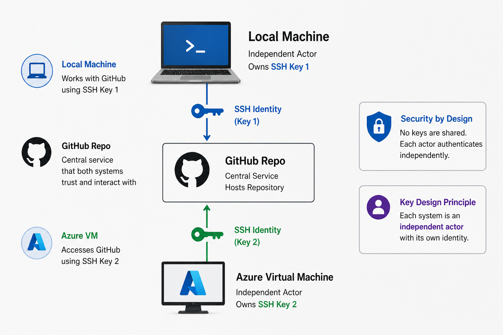
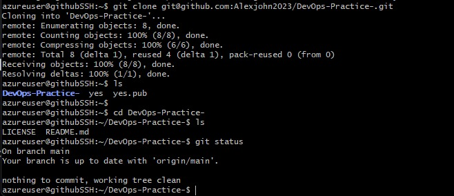
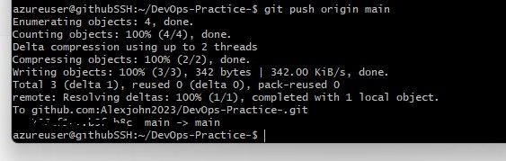

# Secure Cloud-Based Git Workflow (GitHub + SSH + Azure VM)

## Overview

This project demonstrates a **production-relevant DevOps workflow** where code is:

* securely authenticated via SSH
* cloned and executed on a cloud VM
* modified remotely
* synchronized back to GitHub

It simulates a **real-world distributed development environment**, not just local Git usage.

## Why This Project Matters

Most tutorials stop at:

> “git clone → done”

This project goes further:

✔️ Multi-environment workflow (local + cloud)
✔️ Secure authentication (SSH, no passwords)
✔️ Identity separation across systems
✔️ End-to-end Git lifecycle from a remote VM

## Core Engineering Insight

> **Authentication ≠ Authorization**

You can successfully authenticate with GitHub and still fail to access a repository.

This project highlights:

* 🔐 Identity (SSH keys)
* 🔑 Access control (repo permissions)

This is a **real-world failure scenario**, not just theory.

## 🏗️ Architecture (System Thinking)

```text
[ Local Machine ]
        │
        │ SSH Identity (Key 1)
        ▼
   [ GitHub Repo ]
        ▲
        │ SSH Identity (Key 2)
        │
[ Azure Virtual Machine ]
```

### Key Design Principle

Each system is an **independent actor** with its own identity.

## Security Model

* Passwordless authentication via SSH
* Separate SSH keys per environment
* No secrets stored in repo
* All sensitive data redacted in documentation

## 📸 Proof of Execution (End-to-End Validation)

### Clean Repository State on Azure VM



### Clone from GitHub to Azure VM



### Successful Push from Azure VM → GitHub



> ✔️ Code executed remotely
> ✔️ Changes committed from VM
> ✔️ Repository synchronized with GitHub

## Implementation (Condensed)

```bash
# Clone on Azure VM
git clone git@github.com:your-username/DevOps-Practice.git

# Modify
echo "Running from Azure VM" >> test.txt

# Commit & push
git add .
git commit -m "Commit from VM"
git push origin main
```

## DevOps Lifecycle Demonstrated

| Stage            | Description       |
| ---------------- | ----------------- |
| 1️⃣ Create       | GitHub repository |
| 2️⃣ Authenticate | SSH key setup     |
| 3️⃣ Connect      | Clone into VM     |
| 4️⃣ Execute      | Modify remotely   |
| 5️⃣ Synchronize  | Push to GitHub    |

## Real Issues Encountered (And Solved)

### ❌ Permission denied (publickey)

Cause:

* SSH key not registered with GitHub

Fix:

```bash
ssh-keygen -t ed25519
cat ~/.ssh/id_ed25519.pub
```

---

### ❌ Repository not found

Cause:

* Wrong account / no access

Lesson:

> Authentication proves identity
> Authorization grants access

## What This Demonstrates

* Secure cloud-based development
* Multi-environment Git workflows
* SSH-based identity management
* Debugging real DevOps issues
* Systems-level thinking

## Next Evolution

This project is designed to scale into:

* 🐳 Dockerized workloads
* ⚙️ CI/CD pipelines (GitHub Actions)
* ☁️ Infrastructure as Code (Terraform)
* 🌐 Production deployment

---

## 📂 Project Structure

```text
DevOps-Practice/
│
├── README.md
├── images/
│   ├── clean-git-status.png
│   ├── git-push-success.png
│   └── git-branch.png
```

---

## Professional Insight

> DevOps is not about tools—it’s about **how systems interact securely and reliably**.

This project demonstrates:

* identity separation
* secure communication
* distributed execution

---

## Final Thought

This is not just a Git project.

It is a **foundation for building real DevOps systems**.

This project follows a complete system loop:

1. Creation
2. Authentication
3. Connection
4. Execution
5. Synchronization

👉 A closed, production-style DevOps cycle
